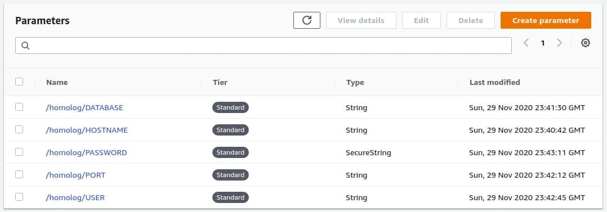

# aws-psenv

> Um script para obter variáveis da AWS SSM Parameter Store a partir de uma path em um formato JSON compatível com a sintaxe de variáveis de ambiente das tasks definitions da Amazon ECS (parâmetro "environment").

## Instalação

Há vários modos de instalá-lo; experimente os comandos abaixo:

```bash
curl https://raw.githubusercontent.com/grupomytec/aws-psenv/main/aws-psenv.sh > ./aws-psenv
chmod +x ./aws-psenv
```

## Requisitos

Você precisará ter instalado as seguintes aplicações:

- [AWS CLI](https://aws.amazon.com/pt/cli/)
- [jq](https://stedolan.github.io/jq/)

## Como usar?

### Sintaxe

```bash
./aws-psenv <ssm_path>
```

## Passo a passo

1. No serviço **AWS SSM Parameter Store** adicione suas variáveis com uma path, por exemplo: `homolog`.



2. Configure sua role ou suas credencias de acesso programático para ter permissões ao Parameter Store e execute como no comando abaixo:

```
./aws-psenv /homolog/
```

Seguindo os exemplos acima você receberia um JSON como o abaixo:

```json
[
  {
    "name": "DATABASE",
    "value": "example"
  },
  {
    "name": "HOSTNAME",
    "value": "db.example.com.br"
  },
  {
    "name": "PASSWORD",
    "value": "senha123456"
  },
  {
    "name": "PORT",
    "value": "1234"
  },
  {
    "name": "USER",
    "value": "fulano"
  }
]
```

*Observe que as senhas gravadas como `SecureString` são retornadas **sem criptografia**.*

## Referências

- [AWS CLI: get-parameters-by-path](https://docs.aws.amazon.com/cli/latest/reference/ssm/get-parameters-by-path.html)
- [Task definition parameters: environment](https://docs.aws.amazon.com/AmazonECS/latest/developerguide/task_definition_parameters.html#container_definition_environment)

## Mantenedores

- Matheus Alves

## Créditos

2020 &copy; Grupo Mytec
